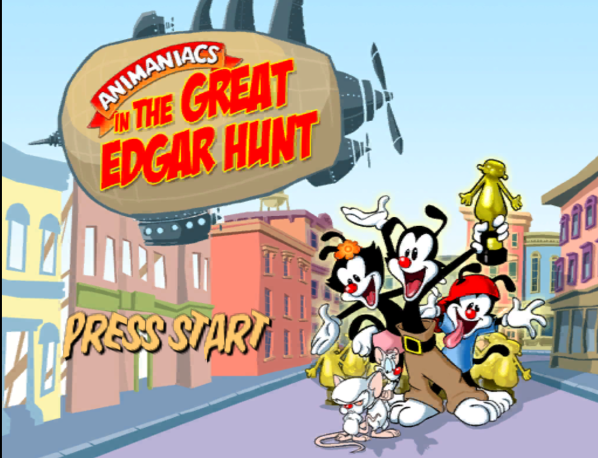
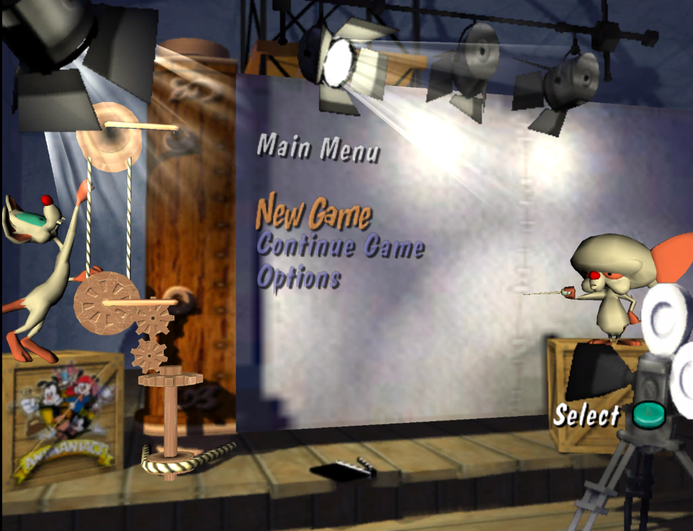
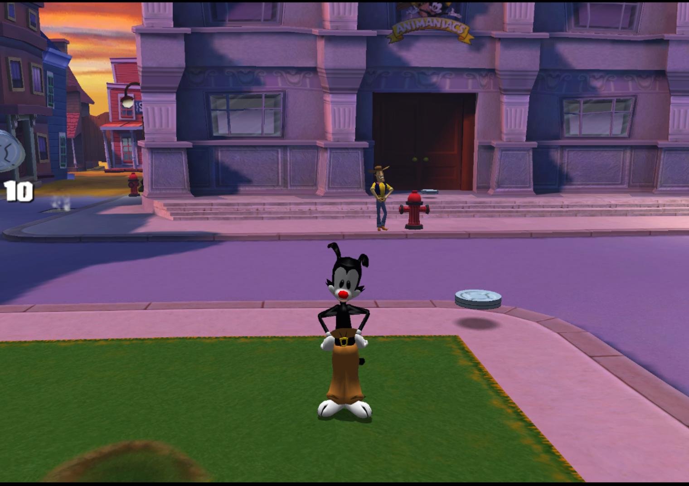

# Animaniacs: The Great Edgar Hunt — GameCube Static Recompilation

Experimental native PC port of the **GameCube USA release of _Animaniacs: The Great Edgar Hunt_** (`GANE7U`) built with **DolRecomp + ModernGekko**.

The project statically recompiles the original PowerPC game code into a native host module while ModernGekko provides the GameCube runtime services, graphics, audio, input, timing, memory and compatibility layer.

> [!IMPORTANT]
> This repository does **not** include the original game ISO or extracted copyrighted game data. You must provide your own copy of the supported USA GameCube release.

## Current status

| Area | Status |
|---|---|
| Boot / publisher screens | ✅ Working |
| Title screen | ✅ Working |
| Main menu | ✅ Working |
| In-game rendering | ✅ Working |
| Gameplay | ✅ Working |
| Vulkan / Wayland path | ✅ Working |
| Native static recompilation | ✅ Working |
| CPU performance tuning | ✅ Enabled |
| Compatibility fallback | ⚠️ Small interpreter range still required |
| Save/load and full-game validation | 🚧 Work in progress |

## Screenshots

### Boot

<p align="center">
  
  
</p>

### Title screen

<p align="center">
  
</p>

### Main menu

<p align="center">
  
</p>

### Gameplay

<p align="center">
  
</p>

## Supported game

This port currently targets one exact game build:

- **Game:** Animaniacs: The Great Edgar Hunt
- **Platform:** Nintendo GameCube
- **Region:** USA
- **Disc ID:** `GANE7U`
- **`main.dol` SHA-256:** `aad70bd7c6e38bed47fa1218066a0ec770850b2e5706240d70d3e7ec4afeb0e1`

`build.sh` verifies the extracted DOL before generating the native module. Other regions or revisions are intentionally rejected for now.

## Requirements

Linux is currently the primary development target.

Recommended packages:

- CMake
- Ninja
- GCC or Clang
- Python 3
- Vulkan-capable GPU and driver
- Wayland session for the default `run.sh`
- `perf` only if you want to profile CPU usage

On Arch Linux, the core build tools are typically available through packages such as `base-devel`, `cmake`, `ninja`, `clang`, `python`, `vulkan-tools` and `perf`.

## Setup

Clone the repository, then place your own USA GameCube ISO here:

```text
iso/ANIMANIACS-USA.iso
```

The ISO and extracted game files are ignored by Git.

A clean checkout can then be built with:

```bash
./build.sh
```

`build.sh` will:

1. build the local ModernGekko runtime and DolRecomp tools;
2. extract `iso/ANIMANIACS-USA.iso` automatically if `extracted/` is missing;
3. validate the target `main.dol` hash;
4. generate the static-recompilation module;
5. compile the module with the optimized host toolchain;
6. publish the runnable files into `runtime/` and `module/`.

Run the game with:

```bash
./run.sh
```

Extra arguments are forwarded to `moderngekko-run`:

```bash
./run.sh --help
```

## CPU optimization

The project now uses several CPU-side optimizations aimed specifically at reducing the overhead around the static-recompiled code path.

### 1. `-O3` module optimization

The generated native module is built at `-O3` by default instead of the previous fixed `-O2` level.

You can override it when building:

```bash
MODULE_OPT_LEVEL=2 ./build.sh
```

Valid values are `0`, `1`, `2` and `3`.

### 2. Clang + ThinLTO by default when available

For the stable C backend, `build.sh` prefers Clang when it is installed. ModernGekko's module builder then enables **ThinLTO**, allowing optimization across the generated module translation units while preserving the strict floating-point flags used by the recompilation runtime.

Force GCC if needed:

```bash
TOOLCHAIN=gcc ./build.sh
```

Or force Clang:

```bash
TOOLCHAIN=clang ./build.sh
```

### 3. Native burst dispatch

The largest runtime optimization in this project is an opt-in path inside the StaticRecomp core that can chain multiple verified native chunks before returning to the C++ chassis.

It is enabled by default by `run.sh`:

```bash
STATICRECOMP_NATIVE_BURST=1 ./run.sh
```

The older conservative behavior can be restored instantly for comparison or regression testing:

```bash
STATICRECOMP_NATIVE_BURST=0 ./run.sh
```

This reduces repeated native-module → runtime → native-module transitions in hot game code. The burst still stops at compatibility fallbacks, host calls, exceptions, timing boundaries and non-chainable chunks.

### 4. Keep the compatibility fallback narrow

Animaniacs still needs this compatibility range for correct gameplay/camera behavior:

```text
8016F6B8-80172D5C
```

Code inside that range deliberately uses Dolphin's interpreter, so reducing this range further is potentially the biggest remaining game-specific CPU win. It must only be narrowed after validating camera, animation and gameplay correctness.

You can test a candidate range without editing the script:

```bash
STATICRECOMP_FALLBACK_RANGES=8016F6B8-80170000 ./run.sh
```

Do not commit a smaller range until it has been tested through menus, camera movement, level transitions and normal gameplay.

## CPU profiling

A small Linux `perf` helper is included:

```bash
./tools/profile_cpu.sh 30
```

That records 30 seconds of gameplay and writes both the raw profile and a text report under `perf/`.

To compare the new native-burst path against the old dispatch behavior:

```bash
STATICRECOMP_NATIVE_BURST=0 ./tools/profile_cpu.sh 30
STATICRECOMP_NATIVE_BURST=1 ./tools/profile_cpu.sh 30
```

When checking the report, pay particular attention to:

- `gGANE7U_recomp.so` generated chunk functions;
- `StaticRecompCore::Run`;
- fallback/interpreter functions;
- memory access helpers;
- graphics-driver CPU time.

The StaticRecomp core also prints useful counters on shutdown, including native dispatches and fallback steps.

## Alternative LLVM backend

The stable default is currently the C backend:

```bash
./build.sh
```

The project can also request DolRecomp's LLVM backend when the compatible LLVM development toolchain is installed:

```bash
BACKEND=llvm TOOLCHAIN=clang ./build.sh
```

Treat this as an experimental performance path and compare it with the C + Clang + ThinLTO build before keeping it.

## Project layout

```text
.
├── assets/
│   └── screenshots/        README screenshots
├── docs/                   Bring-up and technical notes
├── iso/                    Your own ISO (Git ignored)
├── extracted/              Extracted game filesystem (Git ignored)
├── ModernGekko/            Local ModernGekko / DolRecomp source tree
├── tools/
│   └── profile_cpu.sh      Linux perf helper
├── build.sh                Configure, extract, recompile and publish
├── run.sh                  Launch the port
├── README.md
└── LICENSE
```

Generated build trees, runtime state, native modules, extracted game data and profiling output are excluded by `.gitignore`.

## Development notes

More detailed reverse-engineering and bring-up information is available in [`docs/bringup.md`](docs/bringup.md).

The project currently contains a small forced fallback region because fully native execution of that code causes gameplay/camera regressions. The long-term goal is to isolate the exact problematic routine or instruction sequence and move as much of that range as possible back to static recompilation.

## Legal

This project is an independent technical/recompilation project and is not affiliated with or endorsed by Warner Bros., Nintendo, Warthog Games or the original publishers/rightsholders.

No original game ISO is distributed by this repository. Users are responsible for supplying their own legally obtained game data.
